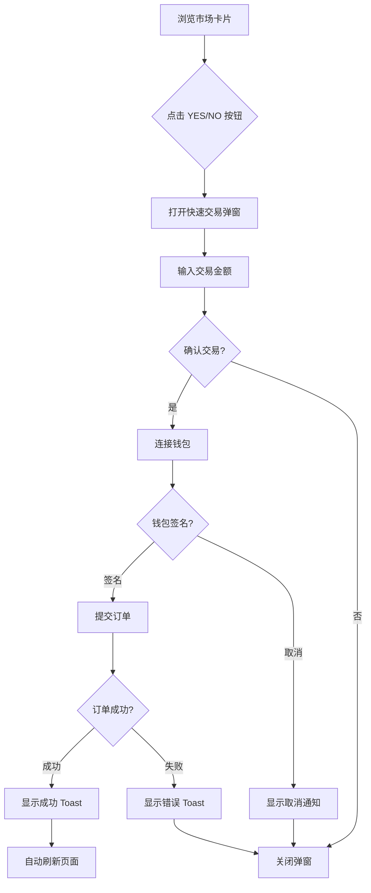

# 🎯 市场卡片快速交易功能文档

## 功能概述

市场卡片现在支持点击 YES/NO 按钮直接进行快速交易，无需跳转到市场详情页面。

## ✨ 功能特性

### 1. **一键交易**
- 🎯 点击卡片上的 YES/NO 按钮
- 💫 弹出快速交易弹窗
- ⚡ 直接下单，无需跳转页面

### 2. **视觉反馈**
- 🌟 按钮 Hover 效果增强
- 💡 发光阴影效果
- 🎭 缩放动画
- 🎨 不同颜色区分 YES/NO

### 3. **Toast 通知**
- ✅ 交易成功：优雅的顶部通知
- ❌ 交易失败：错误信息提示
- ⚠️ 用户取消：友好的警告提示
- 📱 不再使用弹窗（alert）

### 4. **交易流程**
1. 点击 YES 或 NO 按钮
2. 打开快速交易弹窗
3. 输入交易金额（默认 $10）
4. 查看预估收益
5. 确认交易
6. 钱包签名
7. 提交订单
8. 显示成功通知
9. 自动刷新数据

## 🎨 视觉设计

### YES 按钮
```
┌──────────────────────┐
│       YES            │  ← 绿色，hover 发光
│       50¢            │  ← 当前最佳买价
└──────────────────────┘
```

**样式特点**:
- 🟢 背景：绿色半透明 (`bg-green-700/30`)
- 🌟 Hover：更亮 + 发光阴影
- 📏 缩放：文字和价格都有缩放效果

### NO 按钮
```
┌──────────────────────┐
│        NO            │  ← 红色，hover 发光
│       50¢            │  ← 当前最佳卖价
└──────────────────────┘
```

**样式特点**:
- 🔴 背景：红色半透明 (`bg-red-700/30`)
- 🌟 Hover：更亮 + 发光阴影
- 📏 缩放：文字和价格都有缩放效果

## 🔧 技术实现

### 组件修改

#### 1. MarketCard.tsx
添加了快速交易功能：

```typescript
// 状态管理
const [isTradeModalOpen, setIsTradeModalOpen] = useState(false);
const [selectedSide, setSelectedSide] = useState<'YES' | 'NO'>('YES');

// 处理点击
const handleQuickTrade = (side: 'YES' | 'NO', e: React.MouseEvent) => {
  e.stopPropagation(); // 阻止冒泡，避免触发卡片点击
  setSelectedSide(side);
  setIsTradeModalOpen(true);
};

// 渲染弹窗
<QuickTradeModal
  isOpen={isTradeModalOpen}
  onClose={() => setIsTradeModalOpen(false)}
  market={{
    id: market.id,
    title: market.title,
    questionId: market.question_id || `market-${market.id}`
  }}
  side={selectedSide}
/>
```

#### 2. QuickTradeModal.tsx
集成 Toast 通知系统：

```typescript
import { useToast } from '@/components/Toast';

const toast = useToast();

// 成功通知
toast.success(
  `🎉 ${t('orderForm.orderSuccess')}\n\n` +
  `${t('quickTrade.market')}: ${market.title}\n` +
  `${t('orderForm.outcome')}: ${side}\n` +
  `${t('quickTrade.amount')}: $${amount}`,
  { duration: 5000 }
);

// 错误通知
toast.error(`${t('orderForm.orderFailed')}:\n${error.message}`);

// 警告通知
toast.warning(t('orderForm.userCancelled'));
```

## 🎯 用户交互流程

### 完整流程图



### 交互细节

1. **点击按钮**
   - 阻止事件冒泡
   - 记录选择的方向（YES/NO）
   - 打开弹窗

2. **弹窗操作**
   - 显示市场信息
   - 实时获取价格
   - 计算预估收益
   - 提供快捷金额选项

3. **提交交易**
   - 验证钱包连接
   - 创建订单数据
   - 签名订单
   - 提交到服务器

4. **结果反馈**
   - Toast 通知（不是 alert）
   - 自动关闭弹窗
   - 刷新页面数据

## 💡 样式增强

### Hover 效果

```css
/* YES 按钮 */
bg-green-700/30                    /* 默认背景 */
hover:bg-green-700/50              /* Hover 更亮 */
hover:border-green-500             /* 边框高亮 */
hover:shadow-lg                    /* 大阴影 */
hover:shadow-green-500/20          /* 绿色发光 */
group-hover:scale-105              /* 文字缩放 */
group-hover:scale-110              /* 价格放大 */

/* NO 按钮 */
bg-red-700/30                      /* 默认背景 */
hover:bg-red-700/50                /* Hover 更亮 */
hover:border-red-500               /* 边框高亮 */
hover:shadow-lg                    /* 大阴影 */
hover:shadow-red-500/20            /* 红色发光 */
group-hover:scale-105              /* 文字缩放 */
group-hover:scale-110              /* 价格放大 */
```

### 过渡动画

所有动画都使用 `transition-all duration-200` 确保流畅：
- 背景色过渡
- 边框过渡
- 阴影过渡
- 缩放过渡

## 📱 响应式设计

- ✅ 桌面端：完整功能，所有动画
- ✅ 平板端：适配触摸，按钮放大
- ✅ 移动端：优化布局，易于点击

## 🔐 安全性

### 防止误操作
- 点击按钮阻止冒泡，不会误触卡片跳转
- 弹窗点击遮罩关闭
- 提交前需要钱包签名确认

### 数据验证
- 检查钱包连接
- 验证交易金额
- 签名验证订单
- 服务端二次验证

## 📊 数据流

```
用户点击按钮
    ↓
设置交易方向
    ↓
打开交易弹窗
    ↓
获取实时价格 (API)
    ↓
用户输入金额
    ↓
计算预估收益
    ↓
连接钱包
    ↓
签名订单 (ethers.js)
    ↓
提交订单 (API)
    ↓
显示结果 (Toast)
    ↓
刷新页面数据
```

## 🎉 Toast 通知示例

### 成功通知
```
┌────────────────────────────────┐
│ ✅  🎉 下单成功！               │
│                                 │
│     市场: 特斯拉Q1交付量...    │
│     结果: YES                   │
│     金额: $10                   │
│     价格: $0.52                 │
│                                 │
│  ────────────────────           │  ← 进度条
└────────────────────────────────┘
```

### 错误通知
```
┌────────────────────────────────┐
│ ⚠️  ❌ 下单失败               │
│                                 │
│     网络错误，请重试            │
│                                 │
│  ────────────────────           │
└────────────────────────────────┘
```

## 🚀 后续优化建议

### 短期优化
- [ ] 添加交易确认二次提示
- [ ] 支持滑动输入金额
- [ ] 记住用户常用金额
- [ ] 添加交易历史快速访问

### 中期优化
- [ ] 支持市价单/限价单切换
- [ ] 实时显示订单簿深度
- [ ] 添加滑点保护
- [ ] 支持批量交易

### 长期优化
- [ ] AI 推荐交易金额
- [ ] 自动止盈止损
- [ ] 跟单功能
- [ ] 交易机器人

## 📝 使用指南

### 对于用户
1. 浏览市场卡片
2. 看到感兴趣的市场
3. 直接点击 YES 或 NO 按钮
4. 在弹窗中输入金额
5. 确认交易
6. 等待通知

### 对于开发者
1. 组件已集成，无需额外配置
2. Toast 系统自动工作
3. 支持国际化（中英文）
4. 可自定义样式

## 🔍 故障排除

### 问题：按钮点击没反应
**解决**：检查 QuickTradeModal 组件是否正确导入

### 问题：弹窗不显示
**解决**：检查 `isOpen` 状态和 `z-index` 层级

### 问题：Toast 不显示
**解决**：确保 ToastProvider 已在 client-layout 中配置

### 问题：钱包连接失败
**解决**：检查 MetaMask 是否安装和连接

---

## 总结

✅ **功能完整** - 一键交易，流程顺畅  
✅ **视觉精美** - 动画流畅，反馈及时  
✅ **用户友好** - Toast 通知，不打断操作  
✅ **代码优雅** - 组件复用，易于维护  

市场卡片现在是一个完整的交易入口，用户无需跳转即可快速下单！🎉


