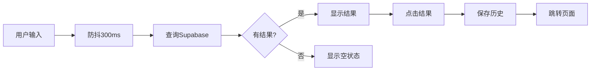

# 🔍 LUMI智能搜索功能文档

## 功能概述

LUMI预测市场的智能搜索功能提供了全面的市场搜索体验，包括实时建议、搜索历史、热门搜索和关键词高亮等功能。

## ✨ 核心特性

### 1. **实时搜索建议**
- 🚀 输入时自动搜索（300ms防抖）
- 📊 显示最多8条相关市场结果
- 🎯 按交易量排序展示
- 💡 智能匹配标题、描述和分类

### 2. **搜索历史**
- 🕒 自动保存最近5次搜索
- 💾 使用localStorage本地存储
- 🔄 快速重复搜索
- 🗑️ 一键清除历史

### 3. **热门搜索**
- 🔥 基于交易量统计
- 📈 动态更新热门关键词
- ⚡ 快速访问热门市场
- 🎨 标签式展示

### 4. **关键词高亮**
- ✨ 搜索词自动高亮显示
- 🎨 金色背景标记
- 📝 不区分大小写匹配

### 5. **视觉效果**
- 🎭 聚焦时边框高亮动画
- 🌊 平滑的淡入淡出效果
- 📱 自定义滚动条样式
- 🎯 加载状态指示器

## 📦 组件结构

### SmartSearchBar 组件

```typescript
import SmartSearchBar from '@/components/SmartSearchBar';

// 基础使用
<SmartSearchBar />

// 带回调函数
<SmartSearchBar 
  onResultClick={(marketId) => {
    console.log('Selected market:', marketId);
  }}
/>

// 自定义样式
<SmartSearchBar 
  className="w-full max-w-2xl"
/>
```

### Props

| 参数 | 类型 | 默认值 | 说明 |
|-----|------|--------|------|
| `onResultClick` | `(marketId: number) => void` | `undefined` | 点击搜索结果时的回调函数 |
| `className` | `string` | `''` | 自定义CSS类名 |

## 🎨 UI/UX设计

### 搜索框状态

1. **默认状态**
   - 灰色边框
   - 灰色搜索图标
   - 占位符文本

2. **聚焦状态**
   - 金色边框高亮（ring-2）
   - 金色搜索图标
   - 背景变亮（bg-white/10）

3. **输入状态**
   - 显示清除按钮
   - 实时搜索加载指示器
   - 展开搜索建议面板

### 建议面板布局

```
┌─────────────────────────────────────┐
│ 🔍 搜索框                            │
└─────────────────────────────────────┘
         ↓
┌─────────────────────────────────────┐
│ 📈 搜索结果 (8)                      │
├─────────────────────────────────────┤
│ • 结果1 (关键词高亮)       [分类]    │
│ • 结果2 (关键词高亮)       [分类]    │
│ • 结果3 (关键词高亮)       [分类]    │
└─────────────────────────────────────┘

或

┌─────────────────────────────────────┐
│ 🕒 最近搜索              [清除]      │
├─────────────────────────────────────┤
│ • 搜索词1                            │
│ • 搜索词2                            │
└─────────────────────────────────────┘
│ 🔥 热门搜索                          │
├─────────────────────────────────────┤
│ [标签1] [标签2] [标签3]              │
└─────────────────────────────────────┘
```

## 🔧 集成方式

### 方式1: 在Navbar中集成（推荐）

```tsx
import Navbar from '@/components/Navbar';

<Navbar 
  showSmartSearch={true}  // 启用智能搜索
  showFilters={true}      // 显示筛选栏
  // ... 其他props
/>
```

### 方式2: 独立使用

```tsx
import SmartSearchBar from '@/components/SmartSearchBar';

export default function MyPage() {
  return (
    <div className="container">
      <SmartSearchBar 
        onResultClick={(marketId) => {
          // 自定义处理逻辑
          router.push(`/market/${marketId}`);
        }}
      />
    </div>
  );
}
```

## 📊 数据流程

### 搜索流程



### 数据库查询

```sql
SELECT id, title, main_category, sub_category, volume, participants
FROM markets
WHERE 
  title ILIKE '%搜索词%' 
  OR description ILIKE '%搜索词%' 
  OR main_category ILIKE '%搜索词%'
ORDER BY volume DESC
LIMIT 8
```

## 🎯 功能细节

### 1. 防抖机制

```typescript
// 300ms防抖，避免频繁请求
debounceTimerRef.current = setTimeout(() => {
  performSearch(searchQuery);
}, 300);
```

### 2. 历史记录管理

```typescript
// 最多保存5条
const updated = [query, ...recentSearches.filter(q => q !== query)].slice(0, 5);
localStorage.setItem('lumi_recent_searches', JSON.stringify(updated));
```

### 3. 键盘快捷键

- `Enter` - 执行搜索
- `Escape` - 关闭建议面板
- 点击外部 - 自动关闭

### 4. 关键词高亮算法

```typescript
const parts = text.split(new RegExp(`(${keyword})`, 'gi'));
// 不区分大小写，保留原始大小写显示
```

## 🎨 样式定制

### 自定义滚动条

```css
.custom-scrollbar::-webkit-scrollbar {
  width: 6px;
}
.custom-scrollbar::-webkit-scrollbar-thumb {
  background: rgba(251, 191, 36, 0.3);
  border-radius: 3px;
}
```

### 动画效果

- 面板淡入: `animate-in fade-in slide-in-from-top-2 duration-200`
- hover效果: `hover:bg-white/5 transition-colors`
- 聚焦环: `focus:ring-2 ring-amber-400/50`

## 📱 响应式设计

### 桌面端
- 搜索框最大宽度: `max-w-2xl`
- 建议面板最大高度: `max-h-96`
- 自动滚动overflow

### 移动端
- 自适应宽度: `w-full`
- 触摸友好的间距
- 简化的面板布局

## 🚀 性能优化

### 1. 查询优化
- 使用数据库索引（title, main_category）
- 限制返回结果数量（8条）
- 防抖减少请求次数

### 2. 渲染优化
- 条件渲染（isFocused）
- memo化搜索结果
- 虚拟化长列表（未来）

### 3. 存储优化
- localStorage缓存历史
- 限制历史记录数量
- 异步数据加载

## 🔐 安全考虑

### XSS防护
- React自动转义内容
- 不使用dangerouslySetInnerHTML
- 用户输入sanitize

### SQL注入防护
- 使用Supabase参数化查询
- 不直接拼接SQL
- 输入长度限制

## 🧪 测试场景

### 功能测试
- [ ] 输入关键词显示结果
- [ ] 清除按钮清空输入
- [ ] 历史记录保存和加载
- [ ] 热门搜索点击
- [ ] 关键词高亮显示
- [ ] 空搜索显示历史和热门
- [ ] 无结果显示空状态

### 交互测试
- [ ] Enter键执行搜索
- [ ] Escape键关闭面板
- [ ] 点击外部关闭面板
- [ ] 防抖延迟正常
- [ ] Loading状态显示

### 样式测试
- [ ] 聚焦高亮效果
- [ ] Hover效果正常
- [ ] 滚动条样式
- [ ] 响应式布局

## 📈 未来改进

### 短期计划
- [ ] 添加搜索结果分页
- [ ] 支持高级筛选（分类、时间范围）
- [ ] 添加搜索建议（拼写纠正）
- [ ] 统计搜索热度

### 长期计划
- [ ] AI智能推荐
- [ ] 语音搜索
- [ ] 图片搜索
- [ ] 相关市场推荐
- [ ] 个性化搜索排序

## 🐛 已知问题

目前暂无已知问题。

## 📝 更新日志

### v1.0.0 (2025-01-XX)
- ✨ 初始版本发布
- 🎨 实时搜索建议
- 📊 搜索历史功能
- 🔥 热门搜索展示
- ✨ 关键词高亮
- 🎯 完整的UI/UX设计

## 🤝 贡献指南

如需改进搜索功能，请：
1. 提交Issue描述问题或建议
2. Fork项目并创建分支
3. 提交Pull Request
4. 等待代码审查

## 📞 技术支持

如有问题，请联系开发团队或查看相关文档。

---

**💡 提示**: 智能搜索是提升用户体验的关键功能，持续优化搜索算法和UI将带来更好的产品体验！


