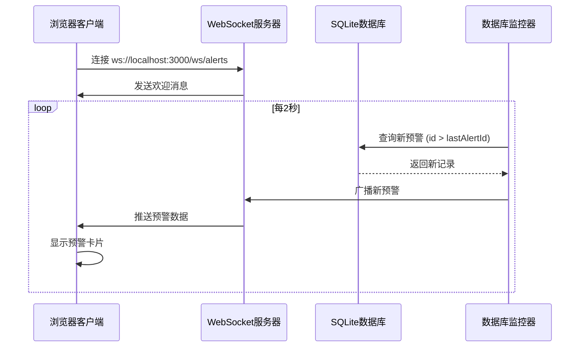

# 实时预警系统使用指南

## ✅ 已修复问题

修复了 `server-with-websocket.js` 中的数据库路径错误：
- **错误路径**：`../duolume-master/utils/database/app.db`
- **正确路径**：`./database/alerts.db`

## 🚀 如何启动服务器

```bash
cd LUMI
npm run dev
```

服务器启动后，你会看到：
```
🚀 服务器已启动
📍 地址: http://localhost:3000
🔌 Socket.IO: ws://localhost:3000
🦢 Alert WebSocket: ws://localhost:3000/ws/alerts
```

## 📊 系统架构

### WebSocket 服务器
- **路径**：`ws://localhost:3000/ws/alerts`
- **功能**：实时推送预警数据到所有连接的客户端
- **监控频率**：每 2 秒检查一次数据库新增预警

### 数据库
- **位置**：`LUMI/database/alerts.db`
- **表结构**：
  ```sql
  CREATE TABLE alerts (
    id INTEGER PRIMARY KEY AUTOINCREMENT,
    timestamp TEXT NOT NULL,
    symbol TEXT NOT NULL,
    message TEXT NOT NULL,
    severity TEXT,
    details TEXT,
    type TEXT,
    created_at TIMESTAMP DEFAULT CURRENT_TIMESTAMP
  );
  ```

## 🧪 测试实时预警

### 方法 1：通过 Node.js 插入测试数据

```javascript
const sqlite3 = require('sqlite3').verbose();
const db = new sqlite3.Database('./database/alerts.db');

const timestamp = new Date().toISOString();
const alert = {
  timestamp,
  symbol: 'BTCUSDT',
  message: '测试实时预警 - BTC价格异常波动监测',
  severity: 'high',
  details: JSON.stringify({
    price_change: -5.2,
    current_price: 89500,
    volume_spike: true,
    alert_type: 'Real-time Test'
  }),
  type: 'price_jump'
};

db.run(
  'INSERT INTO alerts (timestamp, symbol, message, severity, details, type) VALUES (?, ?, ?, ?, ?, ?)',
  [alert.timestamp, alert.symbol, alert.message, alert.severity, alert.details, alert.type],
  function(err) {
    if (err) {
      console.error('插入失败:', err);
    } else {
      console.log('✅ 成功插入测试预警，ID:', this.lastID);
    }
    db.close();
  }
);
```

### 方法 2：使用快速测试脚本

创建 `test-alert.js`：
```javascript
const sqlite3 = require('sqlite3').verbose();
const db = new sqlite3.Database('./database/alerts.db');

function insertTestAlert() {
  const timestamp = new Date().toISOString();
  const alerts = [
    {
      symbol: 'BTCUSDT',
      message: '🚨 BTC价格剧烈波动 -8.5%',
      severity: 'critical',
      details: JSON.stringify({
        price_change: -8.5,
        current_price: 87200,
        trigger: 'Large sell-off detected',
        volume_spike: true
      }),
      type: 'price_jump'
    },
    {
      symbol: 'ETHUSDT',
      message: '⚠️ ETH跟随BTC下跌 -6.2%',
      severity: 'high',
      details: JSON.stringify({
        price_change: -6.2,
        current_price: 3450,
        correlation_btc: true
      }),
      type: 'price_jump'
    }
  ];

  alerts.forEach(alert => {
    db.run(
      'INSERT INTO alerts (timestamp, symbol, message, severity, details, type) VALUES (?, ?, ?, ?, ?, ?)',
      [timestamp, alert.symbol, alert.message, alert.severity, alert.details, alert.type],
      function(err) {
        if (err) {
          console.error('❌ 插入失败:', err);
        } else {
          console.log(`✅ 成功插入 ${alert.symbol} 预警，ID: ${this.lastID}`);
        }
      }
    );
  });

  setTimeout(() => db.close(), 1000);
}

insertTestAlert();
```

运行：
```bash
node test-alert.js
```

## 📱 客户端连接

### 在黑天鹅页面查看实时预警

1. 启动服务器：`npm run dev`
2. 打开浏览器：`http://localhost:3000/black-swan`
3. 打开浏览器控制台，你应该看到：
   ```
   ✅ 已连接到预警系统
   ```
4. 插入测试预警（使用上面的方法）
5. 2秒内，你会在黑天鹅页面看到新预警卡片弹出

### WebSocket 事件流程



## 🔍 调试技巧

### 1. 检查 WebSocket 连接状态

在浏览器控制台运行：
```javascript
// 查看当前 WebSocket 连接
console.log(window.ws ? '已连接' : '未连接');
```

### 2. 查看数据库最新预警

```bash
node -e "const sqlite3 = require('sqlite3').verbose(); const db = new sqlite3.Database('./database/alerts.db'); db.all('SELECT * FROM alerts ORDER BY id DESC LIMIT 5', (err, rows) => { console.log(JSON.stringify(rows, null, 2)); db.close(); });"
```

### 3. 检查服务器日志

服务器会输出以下日志：
- `🦢 Alert WebSocket 客户端连接` - 客户端连接成功
- `🦢 初始化警报监视器。最新警报ID: X` - 监控器启动
- `🦢 广播警报到 X 个客户端` - 预警推送成功

## 🎯 现有数据

数据库中已有 **200 条真实历史预警数据**，包括：

1. **2025-10-10 闪崩事件**
   - BTC从 $115,000 跌至 $86,000（-25%）
   - 全网清算 $191 亿美元
   - 162万账户被强制平仓

2. **历史闪崩事件**
   - 2022年 LUNA/UST 崩盘（-99.99%）
   - 2022年 FTX 崩盘（BTC -17%）
   - 2020年 COVID 黑色星期四（BTC -50%）
   - 2018年 BTC 熊市开始（-33.5%）
   - 更多历史事件...

## ⚡ 性能优化

- **轮询间隔**：2秒（可在 `server-with-websocket.js` 中调整）
- **数据库查询**：只查询新增记录（id > lastAlertId）
- **WebSocket 连接**：自动重连机制（客户端）
- **内存管理**：及时关闭数据库连接

## 🛠️ 常见问题

### Q1: WebSocket 连接失败？
**A**: 确保服务器正在运行 `npm run dev`，并检查端口 3000 是否被占用。

### Q2: 没有收到实时预警？
**A**: 
1. 检查数据库中是否有新数据插入
2. 查看服务器控制台是否有广播日志
3. 确认浏览器控制台显示 "✅ 已连接到预警系统"

### Q3: 预警显示延迟？
**A**: 默认监控间隔为 2 秒，你可以修改 `setInterval(checkForNewAlerts, 2000)` 中的间隔时间。

## 📝 下一步

1. **集成实时数据源**：连接 Binance WebSocket 获取实时价格数据
2. **自动预警检测**：基于价格波动自动生成预警
3. **通知系统**：添加浏览器推送通知
4. **预警过滤**：支持按严重程度、交易对筛选

---

**状态**: ✅ 系统已修复并可正常使用
**最后更新**: 2025-10-26


